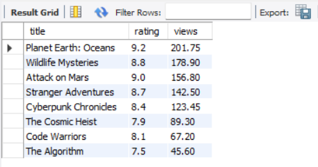
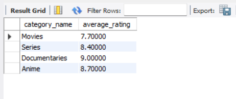

# **Query 1**

select content_id, title, category_name
from content
join category
on content.category_id = category.category_id
order by content_id;

---

# **Query 2**

select title, rating, views_in_millions as views
from content
order by views desc

---

# **Query 3**

select category.category_name, avg(content.rating) as average_rating
from content
join category
on content.category_id = category.category_id
group by content.category_id

---

# **Query 4**

select title, rating, views_in_millions as views, category_name
from content
join category
on content.category_id = category.category_id
where content.rating > 8.5 and content.views_in_millions > 100.0

---

# **Operation 5**

Creating the index on content(category_id) improved performance because 
the database can now quickly locate matching rows in the content table using the index 
instead of scanning the whole table for each category.
This reduced the lookup time during the join, resulting in slightly faster execution overall.

---
